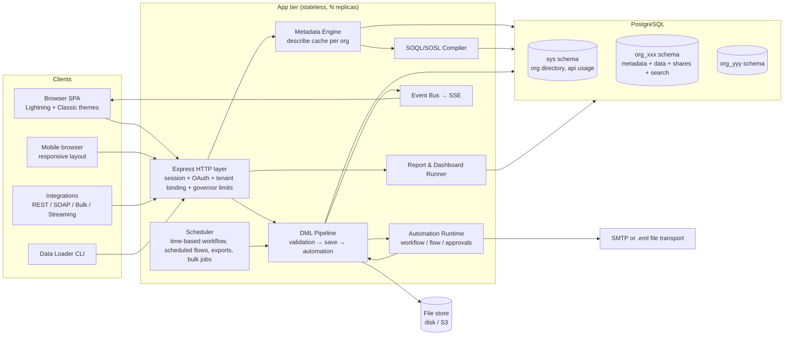
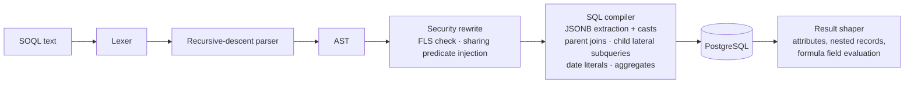

# Meridian Platform — Architecture

**Meridian** is a self-contained, multi-tenant, metadata-driven CRM platform that reproduces the
architecture and working function of Salesforce (Lightning Experience and Classic), API-compatible
at the wire level with the Salesforce REST contract. It ships with a fully configured sample org for
a **London private members' club** — the primary business domain this deployment targets: member
management, membership applications and renewals, club events and RSVPs, dining/room bookings,
guest visits, billing, and member communications.

> Trademark note: Meridian is an independent, API-compatible implementation. It contains no
> Salesforce code or branding; "SOQL", "sObject" etc. are used descriptively for compatibility.

---

## 1. Goals

| Goal | Approach |
|---|---|
| Multi-tenant with DB-level isolation | One PostgreSQL **schema per org**; no cross-schema queries; per-request tenant binding |
| Metadata-driven everything | Objects, fields, layouts, validation, automation, reports are **rows, not code**; runtime interprets them |
| Salesforce-compatible APIs | `/services/data/vXX.X/*` REST surface (sObjects, describe, query, search, composite, limits), OAuth 2.0, Bulk 2.0 CSV jobs, SOAP login/query/CRUD + WSDL, streaming events |
| Lightning-experience UI | React SPA styled on an SLDS-inspired design system; App Launcher, nav bar, record homes, list views, Kanban, reports, dashboards, Setup; Classic theme toggle; responsive/mobile layout |
| Enterprise security model | Profiles, permission sets, object CRUD, field-level security, org-wide defaults, role hierarchy, sharing rules, manual sharing |
| Point-and-click automation | Validation rules, workflow rules (field updates / email alerts / tasks), Flow (record-triggered, scheduled, autolaunched) with visual builder, approval processes |
| Multi-tenant fairness | Per-transaction governor limits (SOQL count, DML count, rows, CPU ms) enforced in the request context |
| Lifecycle tooling | Sandbox org cloning, change-set style metadata deploy, unmanaged/managed package install with namespaces, CSV data loader, scheduled export |

Non-goals for v1 (tracked in `docs/parity-matrix.md`): Apex language, Visualforce, CometD
long-polling wire protocol (we use SSE + a Bayeux-style handshake shim), Einstein/AI features,
full SAML signature validation (scaffolded, dev-mode assertions only).

## 2. Technology stack

| Layer | Choice | Why |
|---|---|---|
| Runtime | Node.js 20+, TypeScript (ESM) | Single language across platform; fast iteration; the metadata interpreter benefits from structural typing |
| Web framework | Express 4 | Ubiquitous, middleware model fits the tenant/session/limits pipeline |
| Database | PostgreSQL 14+ (primary) or embedded **PGlite** (dev/test) | Schemas give hard tenant isolation; JSONB gives a flex-column store like Salesforce's; both engines speak identical SQL so tests run with zero infrastructure |
| Frontend | React 18 + Vite, hand-rolled SLDS-style CSS, hand-rolled SVG charts | No heavyweight UI kit; all record UI is generated from describe/layout metadata, like Lightning |
| Auth | scrypt password hashing, opaque session tokens, OAuth 2.0 (authorization_code, password, refresh_token, client_credentials) | Self-contained, no external IdP required; SAML endpoint scaffold for SSO |
| Email | Pluggable transport: `file` (default — writes .eml to disk + EmailMessage records) or SMTP via nodemailer | Works offline out of the box |
| Files | Content-addressed store on local disk (`DATA_DIR/files`), ContentDocument/ContentVersion model | S3-compatible layer can be swapped in behind `FileStore` |
| Search | PostgreSQL `tsvector` index maintained on every DML, SOSL compiled against it | No external search cluster |
| Deploy | Dockerfiles, docker-compose, Kubernetes manifests | Local single-command start; horizontal scale on k8s |

## 3. System topology



The app tier is stateless: sessions, metadata, data, queues all live in PostgreSQL, so replicas
scale horizontally behind any load balancer. The scheduler runs in every replica with an advisory
lock so exactly one instance executes due jobs.

## 4. Multi-tenancy & isolation

* Every org (tenant) is a row in `sys.orgs` and owns a dedicated PostgreSQL schema
  `org_<15-char id>` containing **all** of its metadata tables and data tables. There are no
  cross-tenant tables, foreign keys, or queries; the tenant schema is resolved once per request
  from the session/OAuth token and every statement executes with `search_path` pinned to it.
* A **sandbox** is a full schema clone (`CREATE SCHEMA` + copy of metadata, optionally data),
  registered in `sys.orgs` with `is_sandbox = true` and a pointer to its production org.
* IDs are Salesforce-style: 15-character case-sensitive base-62 with a 3-character **key prefix**
  per object (`001` Account, `003` Contact, `005` User, `006` Opportunity, `00Q` Lead, `500`
  Case, custom objects `a00`, `a01`, …) plus the standard 18-character checksum suffix. The org id
  (`00D…`) keys the schema name.

## 5. Metadata model (the heart of the platform)

Salesforce stores tenant data in universal tables interpreted through metadata; Meridian does the
equivalent with JSONB flex storage:

* `object_def`, `field_def`, `picklist_set/value`, `record_type_def`, `layout_def` (+ per-profile
  assignment), `validation_rule`, `list_view`, `app_def`, `workflow_rule`, `flow_def`,
  `approval_process`, `email_template`, `report_def`, `dashboard_def`, `profile`, `permission_set`,
  `object_perm`, `field_perm`, `role`, `group_def` (incl. queues), `sharing_setting`,
  `sharing_rule`, `translation`, `currency_type`, `package_def`, `change_set`, `cron_job`.
* Each object gets one physical table `d_<apiname>`: fixed system columns
  (`id, name, owner_id, record_type_id, created_by_id, created_date, last_modified_by_id,
  last_modified_date, system_modstamp, currency_iso_code, is_deleted, deleted_date`) and a
  `fields JSONB` column holding every custom/standard body field keyed by API name. Indexes:
  GIN on `fields`, b-tree on owner/name/dates, and expression indexes created automatically for
  external-ID, unique, and lookup fields.
* Creating a custom object or field is a metadata insert; the engine issues the `CREATE TABLE` /
  index DDL on the fly and invalidates the org's describe cache. **No code deploys, ever.**
* Field types: Text, TextArea, LongTextArea, RichText, Checkbox, Number, Currency, Percent, Date,
  DateTime, Time, Email, Phone, Url, Picklist, MultiselectPicklist (with controlling-field
  dependencies), Lookup, MasterDetail (cascade delete + rollup host), **Formula** (evaluated at
  read time by the formula engine), **RollupSummary** (COUNT/SUM/MIN/MAX over child records,
  incrementally maintained on child DML), AutoNumber, Geolocation.
* Describe output (`/sobjects/{type}/describe`) is generated from this metadata in the exact
  Salesforce response shape and drives both the API and the entire record UI.

## 6. Query pipeline (SOQL/SOSL)



Supported: field lists with 5-level parent traversal (`Booking__r.Member__r.Account.Name`),
child subqueries, `WHERE` with full boolean algebra, `LIKE`, `IN/NOT IN` (incl. semi-joins),
`INCLUDES/EXCLUDES`, all Salesforce date literals (`TODAY`, `LAST_N_DAYS:n`, `THIS_MONTH`, …),
`GROUP BY` (+ `HAVING`), aggregates (`COUNT, COUNT_DISTINCT, SUM, AVG, MIN, MAX`), `ORDER BY …
NULLS FIRST|LAST`, `LIMIT/OFFSET`, `FOR UPDATE` (row lock), `queryMore` cursors. Sharing is
enforced by injecting an ownership/share predicate for non-View-All users; FLS by rejecting
unreadable fields with `INVALID_FIELD`, exactly as the Salesforce API does.

## 7. DML pipeline — Salesforce order of execution

For every insert/update/delete/upsert (single, collection, or Bulk chunk):

1. Load old rows, apply new values, system field validation (types, required, picklist validity,
   lookup existence, unique/external-id).
2. **Before-save flows** (fast field updates).
3. **Validation rules** (formula engine; `error_field` targeting).
4. Auto-number/formula defaults; save to JSONB row inside the transaction.
5. Assignment rules (Lead/Case queues), **after-save flows**, **workflow rules** — field updates
   re-run validation and re-save; email alerts / task actions enqueue.
6. **Approval process** side effects (record lock, pending work items).
7. Rollup-summary recalculation on master records; cross-object formula cache bump.
8. Field **history tracking** rows, Chatter feed "tracked change" items, search index refresh,
   streaming event publish, escalation/time-based triggers enqueued.
9. Governor-limit accounting throughout; any breach rolls back the whole transaction with
   `LIMIT_EXCEEDED`.

Deletes honour master-detail cascade, lookup clean-up rules, and land in the Recycle Bin
(`is_deleted`) with undelete support and a 15-day purge job.

## 8. Security model

* **Authentication**: username/password (scrypt), UI sessions (`sid` cookie), API sessions
  (Bearer), OAuth 2.0 endpoints `/services/oauth2/authorize|token|revoke|userinfo` with connected
  apps; refresh tokens; per-org My Domain-style host prefix supported via `X-Org` or subdomain.
* **Authorization** resolution per request: profile + permission sets → object CRUD map + field
  read/edit map (FLS). Record access = org-wide default ∘ role-hierarchy grant ∘ sharing rules ∘
  manual shares ∘ ownership, with View All / Modify All overrides. Computed shares are stored per
  object in `share_<apiname>`-style rows in `record_share` for O(1) predicates.
* Admin capabilities are profile permissions (`ManageSetup`, `ModifyAllData`, `ManageUsers`, …).

## 9. Automation

* **Formula engine** — one evaluator powers formula fields, validation rules, workflow criteria,
  flow expressions and default values. ~60 functions (logic, text, date/time, math, ISPICKVAL,
  ISCHANGED, PRIORVALUE, cross-object merge fields).
* **Workflow rules** — criteria (formula or field filters) + immediate/time-based actions: Field
  Update, Email Alert, Task, Outbound Message (HTTP POST).
* **Flow** — JSON DSL with visual builder: triggers (record created/updated/deleted, scheduled,
  autolaunched), elements: Assignment, Decision, Loop, Get/Create/Update/Delete Records, Email,
  Post to Feed, Submit for Approval, Subflow. Interpreted, transactional, limit-accounted.
* **Approval processes** — entry criteria, multi-step approver chains (user, manager, queue),
  submit/approve/reject/recall actions, record locking, work-item inbox in the UI.
* The club org ships with live examples: *Membership Application* approval chain, renewal-reminder
  scheduled flow, event-capacity validation, guest-visit limits, dues invoice generation.

## 10. Reports, dashboards, search, collaboration

* **Reports**: tabular/summary/matrix formats over any object + parent relationships,
  filter logic incl. cross filters, up to 3 grouping levels, bucket-free v1, summary aggregates,
  row limits, charts (bar, column, line, donut, funnel — SVG). Reports run **as the running user**
  (their sharing + FLS).
* **Dashboards**: grid components bound to reports (metric, chart, table, gauge), running-user or
  viewer mode, auto-refresh.
* **Global search / SOSL**: `FIND {term} IN ALL FIELDS RETURNING Account(...), Member__c(...)`
  against per-record tsvector; typeahead endpoint for the header search box.
* **Chatter-style feed**: posts, comments, @mentions, tracked-change entries per record; files
  attach via ContentDocumentLink.

## 11. API surface (wire-compatible)

```
GET  /services/data                          → version list
GET  /services/data/v59.0/sobjects           → global describe
GET  /services/data/v59.0/sobjects/{o}/describe
CRUD /services/data/v59.0/sobjects/{o}[/{id}] (+ upsert by external id)
GET  /services/data/v59.0/query?q=…          → {totalSize, done, records[{attributes,…}], nextRecordsUrl}
GET  /services/data/v59.0/query/{locator}    → queryMore
GET  /services/data/v59.0/queryAll, /search?q=SOSL, /parameterizedSearch
POST /services/data/v59.0/composite | /composite/batch | /composite/sobjects | /composite/tree
GET  /services/data/v59.0/limits | /recent
POST /services/data/v59.0/jobs/ingest        → Bulk 2.0 (CSV upload, state machine, results)
POST /services/oauth2/token | /authorize | /revoke | /userinfo | /introspect
POST /services/Soap/u/59.0                   → SOAP login/describe/query/create/update/delete (+ /wsdl)
GET  /cometd/59.0                            → Bayeux-style handshake, SSE delivery of PushTopic events
```

Errors use Salesforce shapes (`[{"message","errorCode","fields"}]`), status codes, and header
conventions (`Sforce-Limit-Info: api-usage=…`).

## 12. Internationalisation

Org default + per-user locale (`en_GB` default), language, timezone (`Europe/London` default);
`Intl`-based date/number/currency formatting server- and client-side. **Multi-currency**: org
currency table with conversion rates, `CurrencyIsoCode` on every record, `convertCurrency()` in
reports/SOQL result shaping. **Translation workbench**: per-language overrides for labels,
picklist values, apps, error messages; UI renders through the translation layer.

## 13. Governor limits (per transaction)

`soqlQueries:100 · queryRows:50000 · dmlStatements:150 · dmlRows:10000 · cpuMs:10000 ·
heapBytes:6MB (approx) · emails:10 · futureCalls:50`, plus org-level daily API request counting
surfaced in `/limits` and `Sforce-Limit-Info`. Implemented as a `LimitContext` carried through
every engine; breaches throw `LIMIT_EXCEEDED` and roll back.

## 14. The club domain layer

Everything club-specific is **ordinary platform metadata** in the seed org (proving the
customization engine end-to-end):

* Custom objects: `Membership__c` (master-detail → Contact), `Membership_Tier__c`,
  `Club_Event__c`, `Event_RSVP__c`, `Booking__c` (dining / rooms / private hire),
  `Guest_Visit__c`, `Invoice__c` + `Payment__c`, `Reciprocal_Club__c`, `Interest_Group__c`.
* Standard objects repurposed the Salesforce way: **Lead** = membership enquiry (converts to
  Contact + Membership application **Opportunity**), **Case** = member request/complaint,
  **Campaign** = event marketing/comms, **Task/Event** = member touchpoints.
* Shipped automation: application approval process, renewal reminder scheduled flow, dues
  invoice workflow, guest-limit validation rule, event capacity checks.
* Shipped analytics: membership pipeline, churn/renewals, event attendance, F&B booking
  utilisation, ageing receivables — as reports wired into a "Club Management" dashboard.
* UK defaults: GBP corporate currency, en_GB locale, Europe/London timezone, VAT-inclusive
  currency formatting in invoice layouts.

## 15. Scaling strategy

* **Vertical partitioning by schema** keeps per-org working sets small and vacuumable; the
  describe cache (per org, LRU, invalidated on metadata DML) removes metadata reads from the hot
  path.
* Stateless app replicas; sticky sessions unnecessary (DB-backed sessions). SSE connections are
  fan-out from an in-process bus fed by LISTEN/NOTIFY so events reach every replica.
* Largest-org growth path: move hot orgs to their own database (the `sys.orgs.dsn` column allows
  per-org connection strings), then table-partition `d_*` tables by date.
* Read replicas for report/dashboard workloads via the `REPORT_DSN` pool.
* Bulk ingest bypasses per-row automation optionally (like Salesforce Bulk "serial mode"
  toggles), batching 2 000-row chunks in one transaction each.

## 16. Repository layout

```
server/   Express app, engines (metadata, soql, formula, dml, automation, reports, api), migrations, tests
client/   React SPA (Lightning + Classic themes), Setup UI, builders
scripts/  dataloader CLI, weekly export, dev utilities
deploy/   Dockerfiles, docker-compose.yml, k8s manifests
docs/     architecture (this file), deployment, API guide, admin guide, parity matrix
```

See `docs/deployment.md` for runbooks and `docs/parity-matrix.md` for the feature-by-feature
statement of what is implemented, simplified, or scaffolded.
